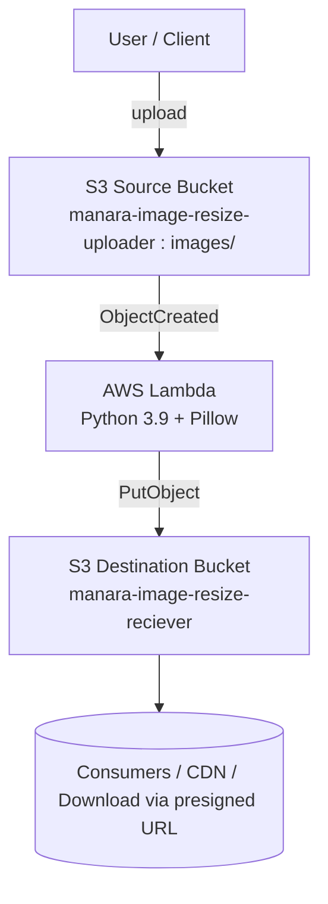
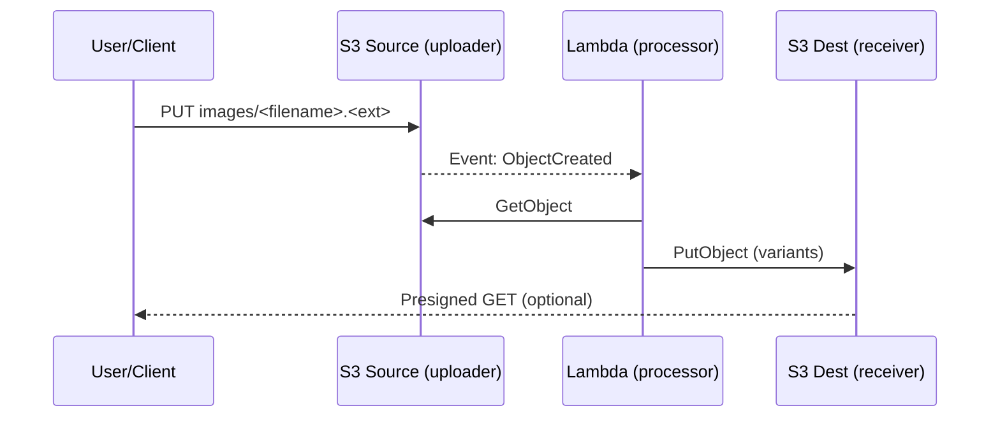

# AWS Solution Architecture

> A serverless, event-driven image processing pipeline using Amazon S3 triggers, AWS Lambda (Python + Pillow), and separate source/destination buckets.

---

## 📖 Table of Contents
1. [Overview](#overview)  
2. [Architecture Diagram](#architecture-diagram)  
3. [Component Breakdown](#component-breakdown)  
   - [Amazon S3 (Source & Destination)](#amazon-s3-source--destination)  
   - [AWS Lambda (Processor)](#aws-lambda-processor)  
   - [Lambda Layer (Pillow)](#lambda-layer-pillow)  
   - [S3 Event Notifications](#s3-event-notifications)  
   - [(Optional) API Gateway](#optional-api-gateway)  
   - [(Optional) DynamoDB](#optional-dynamodb)  
   - [(Optional) Step Functions](#optional-step-functions)  
4. [Data Flow](#data-flow)  
5. [High Availability & Fault Tolerance](#high-availability--fault-tolerance)  
6. [Security Considerations](#security-considerations)  

---

## 📌 Overview

This serverless architecture processes user-uploaded images by leveraging:

- **Amazon S3** for raw uploads (source) and processed outputs (destination)  
- **AWS Lambda (Python 3.9 + Pillow)** for resizing/watermarking  
- **S3 object-created events** to trigger processing automatically  
- **Environment variables** to decouple code from infrastructure (bucket names, prefixes)  
- **Optional** integrations for uploads (API Gateway), metadata (DynamoDB), and workflows (Step Functions)

**Your deployment (concrete values):**
- **Source bucket:** `manara-image-resize-uploader` (prefix: `images/`)  
- **Destination bucket:** `manara-image-resize-reciever`  
- **Lambda runtime:** Python 3.9  
- **Env vars:** `DEST_BUCKET=manara-image-resize-reciever`, `SRC_BUCKET=manara-image-resize-uploader` *(optional guard)*

---

## 🖼️ Architecture Diagram


*Figure 1: High-level diagram of the solution*

---

## 🔍 Component Breakdown

### Amazon S3 (Source & Destination)
- **Source bucket (`manara-image-resize-uploader`)**  
  - Receives user uploads under `images/` (e.g., `images/cat-s3.png`).  
  - Emits **ObjectCreated:Put** events to Lambda.  
- **Destination bucket (`manara-image-resize-reciever`)**  
  - Stores resized outputs in logical folders (e.g., `desktop/`, `tablet/`, `phone/`).  
  - Block Public Access enabled; access via IAM or presigned URLs.

### AWS Lambda (Processor)
- **Purpose:** Read original from source bucket, create resized variants, write to destination bucket.  
- **Key settings:**  
  - Runtime **Python 3.9**, Memory ≥ **512 MB**, Timeout ≥ **30 s**.  
  - **Environment variables:**  
    - `DEST_BUCKET` (required)  
    - `SRC_BUCKET` (optional safety check)

**Execution role permissions (minimum):**
```json
{
  "Version": "2012-10-17",
  "Statement": [
    { "Effect": "Allow", "Action": ["s3:GetObject"], "Resource": "arn:aws:s3:::manara-image-resize-uploader/*" },
    { "Effect": "Allow", "Action": ["s3:ListBucket"], "Resource": "arn:aws:s3:::manara-image-resize-uploader",
      "Condition": { "StringLike": { "s3:prefix": ["images/*"] } } },
    { "Effect": "Allow", "Action": ["s3:PutObject"], "Resource": "arn:aws:s3:::manara-image-resize-reciever/*" },
    { "Effect": "Allow", "Action": ["logs:CreateLogGroup","logs:CreateLogStream","logs:PutLogEvents"], "Resource": "*" }
  ]
}
```

### Lambda Layer (Pillow)
- **Purpose:** Ship native image libs (`Pillow`) compatible with Lambda.  
- **Compatibility:** Built for **python3.9** and the function’s **architecture** (x86_64 or arm64).  
- **Structure check:** ZIP root contains `python/PIL/...` and `python/Pillow-<ver>.dist-info/...`.

### S3 Event Notifications
- **Trigger:** Source bucket → Event notification → **Lambda**  
  - Event type: `PUT` *(ObjectCreated)*  
  - Prefix: `images/` *(recommended to limit to uploads folder)*  
- **Note:** No Lambda “asynchronous destination” is required; the function writes to the destination bucket directly.

### (Optional) API Gateway
- **Purpose:** Provide a signed upload endpoint or direct upload proxy.  
- **Pattern:** Client requests a **pre-signed URL** → uploads file to source bucket without exposing credentials.

### (Optional) DynamoDB
- **Purpose:** Persist image metadata (uploader, timestamps, sizes, processing status, checksum/idempotency).  
- **Partition key:** `imageId` or the S3 object key.

### (Optional) Step Functions
- **Purpose:** Orchestrate multi-step processing (e.g., resize → watermark → optimize → notify), handle retries, DLQs.

---

## 🔄 Data Flow

> GitHub supports **Mermaid** and will render the following as a diagram.



**Alternative (sequence view):**


---

## 🛡️ High Availability & Fault Tolerance

- **Serverless scaling:** Lambda scales horizontally with incoming S3 events.  
- **Retries:** S3 → Lambda invokes at-least-once; transient errors retried automatically by Lambda.  
- **Idempotency:** Use deterministic destination keys and/or checksums to avoid duplicates.  
- **Concurrency control:** Configure reserved concurrency if you need to rate-limit downstream dependencies.  
- **(Optional) DLQ:** Add an SQS **dead-letter queue** to capture failed invocations for later replay.  
- **Regional HA:** S3 and Lambda are multi-AZ by design.

---

## 🔐 Security Considerations

- **Least privilege IAM:** Scope the Lambda role to exactly the two buckets and the `images/` prefix on the source.  
- **Block Public Access:** Keep both S3 buckets private; use **pre-signed URLs** for controlled access.  
- **Encryption:**  
  - **At rest:** Enable S3 default encryption (SSE-S3 or SSE-KMS).  
  - **In transit:** HTTPS for all client uploads/downloads.  
  - If using **SSE-KMS**, grant the Lambda role `kms:Decrypt` (source) / `kms:Encrypt` (dest) on the KMS keys.  
- **Network:** Consider **VPC endpoints** for S3 to keep traffic inside AWS.  
- **Monitoring:** CloudWatch Logs for Lambda, S3 server access logs / CloudTrail data events for auditability.  
- **Validation:** Validate MIME type/extension in Lambda to accept only supported image formats and reject over-sized files.
